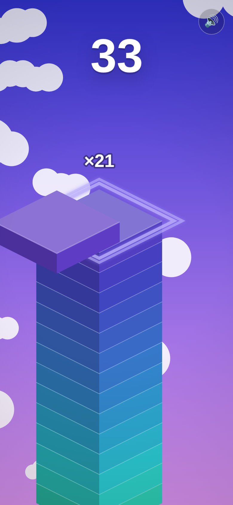

# Sky Temple ⛩

**A one-tap hyper-casual tower stacker.** Stones slide across the screen; tap to drop them. Land one perfectly and it glows. Chain perfects and your shrinking stone grows back. Miss the edge and your temple falls.

Built entirely in this repo with zero dependencies and zero binary assets: every sprite, sky, cloud and sound is generated in code. The gameplay core is a DOM-free module designed to be ported to Unity (C#) or Xcode (Swift) — see [`docs/PORTING.md`](docs/PORTING.md).

<p align="center">
  
  
  
  
</p>

## Play

```bash
npm start          # serves on http://localhost:8080 (any static server works)
```

Open it on a phone on the same network or add it to your home screen: it is a fullscreen, offline-capable PWA.

| Input | Action |
|------|--------|
| Tap / click / Space | Drop the sliding stone |
| 🔊 button | Mute (remembered) |

## The loop

1. A stone slides back and forth above the tower, alternating X and Z axes each turn.
2. **Tap** to drop. Whatever overhangs the stone below is sheared off and tumbles away. The next stone inherits the smaller footprint.
3. **Perfect** (within tolerance) snaps the stone into place with a ring, a rising note and a combo counter. After 3 perfects in a row the stone regrows a little each time, up to full size.
4. Speed ramps with score. Zones are announced at 10, 25, 50, 75, 100, 150 and 200 stones as the sky shifts from dawn through dusk, night and deep space.
5. Miss the tower entirely → the camera pulls back to show your temple, score vs best, and an instant retry.

Full design notes, retention hooks and monetisation plan: [`docs/DESIGN.md`](docs/DESIGN.md).

## Project layout

```
index.html                 shell + overlays (title, HUD, game over)
css/style.css              UI chrome
src/
  core/
    config.js              every tuning number (one place to balance the game)
    stack.js               THE GAME — pure simulation, no DOM. Port this first.
    palette.js             procedural colours: stone shades, sky bands
  render/
    renderer.js            2:1 isometric canvas renderer, clouds, stars, plinth
    effects.js             falling slices, perfect rings, sparks, text pops, shake
  audio/sfx.js             WebAudio synth: place / perfect melody / miss / milestone
  platform/
    input.js               one verb: tap (pointer + keyboard)
    storage.js             best score, mute, games played (localStorage)
    haptics.js             Vibration API; maps to UIImpactFeedbackGenerator on iOS
  main.js                  state machine, camera, render loop, UI glue
art/
  icon.svg                 app icon, generated from the game's own projection
  icon-{180,192,512,1024}.png
  screens/*.png            store screenshots, captured from the real game
tools/
  make-icon.mjs            regenerates art/icon.svg
  render-art.mjs           rasterises icons + screenshots in headless Chromium; doubles as a smoke test
tests/stack.test.js        core rules: cut geometry, perfect snap, regrow, miss, milestones
docs/DESIGN.md             game design document
docs/PORTING.md            Unity / Xcode porting guide
manifest.webmanifest, sw.js   installable, offline PWA
```

## Develop

```bash
npm test             # core logic tests (node:test, no deps)
npm run icons        # regenerate PNG icons from art/icon.svg
npm run screens      # icons + screenshots + headless smoke test (needs playwright + chromium)
node tools/make-icon.mjs   # rebuild the SVG icon
```

Balance the game by editing `src/core/config.js` only. The deploy workflow runs the tests on every push and publishes `main` to GitHub Pages.

## License

MIT
