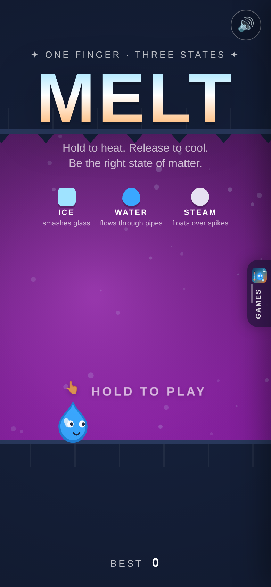
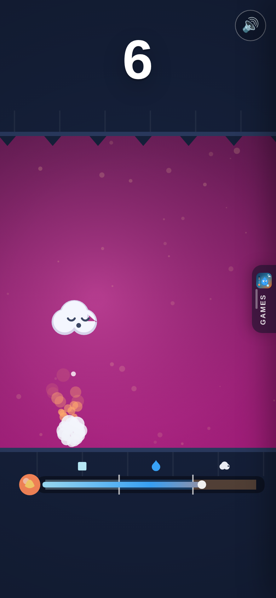
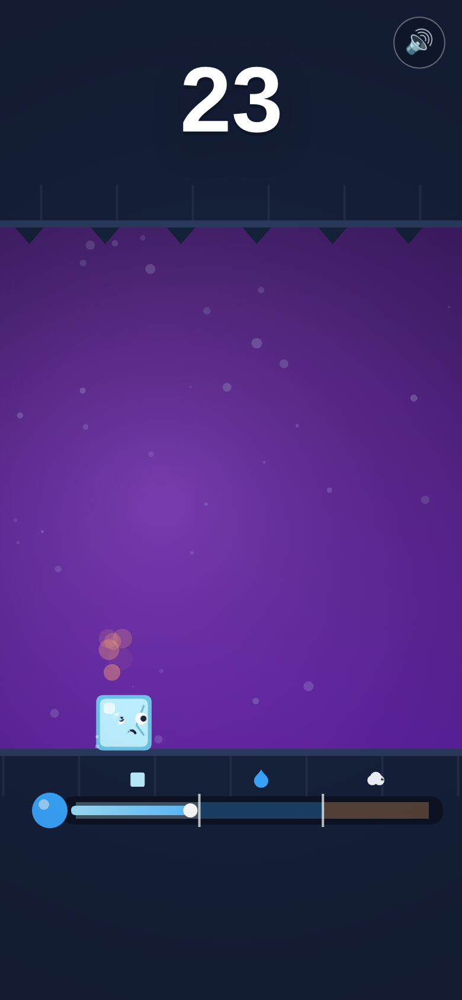
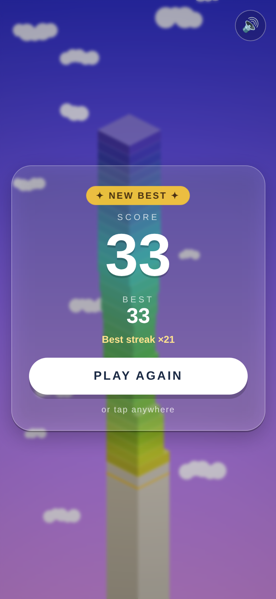

# Mythic World games: MELT · SKIP · Sky Temple

Three small games, all built in this repo with zero dependencies and all art and sound generated by code. A right-edge drawer switches between them.

| Game | Path | One line |
|---|---|---|
| **MELT** | `/` | Hold to heat, release to cool. Be ice, water or steam at the right moment. |
| **SKIP** | `/skip/` | Skip a stone across a sunset lake. Tap when it kisses the water. Game Center ready. |
| **Sky Temple** | `/sky-temple/` | Tap to stack stones to the gods. |

---

# MELT 💧🔥

**Hold to heat. Release to cool. Be the right state of matter.**

A one-finger hyper-casual runner with a mechanic that doesn't exist yet: your only control is a thermometer. Hold and your water drop boils into **steam** and floats over spikes. Let go and it cools back to **water** to flow through pipes. Keep cooling and it freezes into **ice** to smash glass. Geysers and cold vents shove your temperature when you least expect it.

Built entirely in this repo: zero dependencies, zero binary assets, every shape, colour and sound generated in code. The rules are one DOM-free module designed to port to Unity (C#) or Xcode (Swift). See [`docs/DESIGN.md`](docs/DESIGN.md) and [`docs/PORTING.md`](docs/PORTING.md).

<p align="center">
  
  
  
  
</p>

## Play

```bash
npm start      # http://localhost:8080 — any static server works
```

Installable fullscreen PWA, works offline.

| Input | Action |
|------|--------|
| Hold (touch / mouse / Space) | Heat up |
| Release | Cool down |

## The loop

1. You auto-run. A thermometer on the left shows three bands: ice, water, steam.
2. Hold to heat, release to cool. Cross a band and you change form, with a burst, a sound and a bounce.
3. Each obstacle lets exactly one kind of thing through. The first few of every type carry a label and the icon of the state that passes.
4. Speed ramps, new obstacle types unlock, hazards start shoving your temperature. Named milestones mark your progress.
5. Die and the end card tells you in one line what you were and what you needed. One tap to go again.

Spacing between obstacles is a **time budget** derived from the state change you'll need, and a 20-seed autopilot test proves every course is beatable with a 0.25 s reaction. Details in the design doc.

## Project layout

```
index.html, css/style.css       shell + overlays
src/core/config.js              every tuning number
src/core/melt.js                THE GAME — pure simulation + reference autopilot. Port this first.
src/core/palette.js             temperature-driven colours
src/render/renderer.js          side-view canvas renderer: rock, obstacles, droplet, gauge
src/render/effects.js           wisps, frost, bursts, deaths, text pops, shake
src/audio/sfx.js                WebAudio synth incl. a heat-hiss bed
src/platform/                   hold input, storage, haptics
src/main.js                     state machine, loop, UI glue
art/                            generated icon (SVG + PNGs) and store screenshots
tools/make-icon.mjs             regenerates the icon
tools/render-art.mjs            rasterises icons, captures screenshots, smoke-tests in headless Chromium
tests/melt.test.js              rules, spacing fairness, 20-seed survival
docs/                           design document, porting guide
switcher.js                     right-edge drawer shared by all games: tap the handle or swipe from the edge to switch
skip/                           SKIP — skip a stone across a sunset lake; menus, local + Game Center leaderboards (see skip/docs/GAMECENTER.md)
sky-temple/                     the first prototype (a Stack-style tower game), still playable at /sky-temple/
```

## Develop

```bash
npm test           # MELT + Sky Temple core tests
npm run icons      # rebuild art/icon.svg and PNGs
npm run screens    # icons + screenshots + smoke test (needs playwright + chromium)
```

Balance the game in `src/core/config.js` only; the survival test will tell you if a change makes the course unfair. The deploy workflow runs the tests and publishes `main` to GitHub Pages.

## License

MIT
